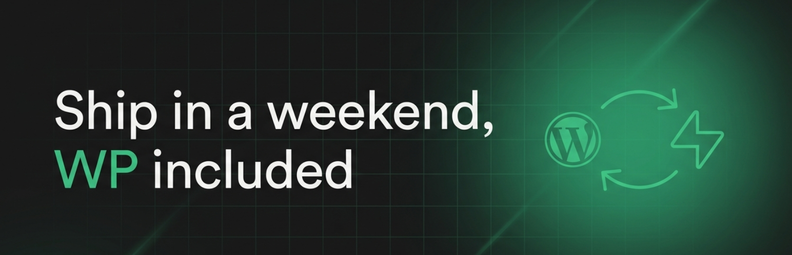
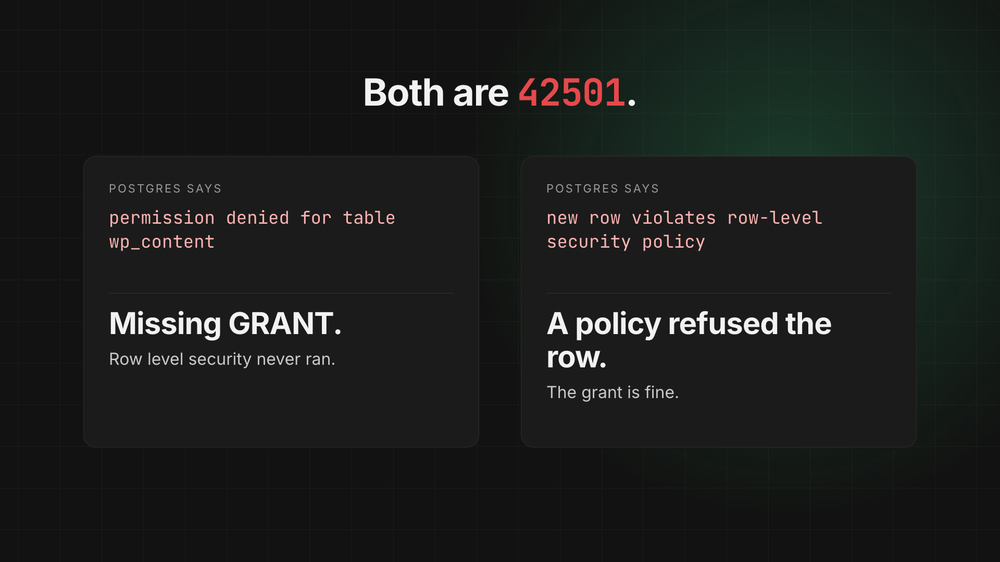
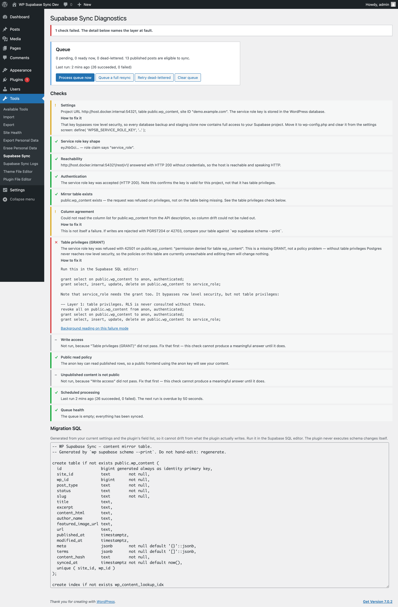

# WP Supabase Sync

[](https://wordpress.org/download/)
[](https://www.php.net/supported-versions.php)
[](https://supabase.com/docs/guides/api)
[](https://github.com/WordPress/WordPress-Coding-Standards)
[](LICENSE)

[](.github/brag.mp4)

*24-second demo, with sound. Click to play.*

Mirrors WordPress content into a Supabase Postgres table, so a separate frontend
— Next.js, a mobile app, anything — can query your content straight from Supabase
instead of calling the WordPress REST API.

WordPress stays the source of truth and the editing experience. Supabase becomes
the fast, queryable read layer, with row level security on it.

> Not affiliated with or endorsed by Supabase. This plugin *connects* WordPress
> to Supabase; "Supabase" is a trademark of Supabase, Inc.

---

## Why this exists

Plenty of plugins push data somewhere. The thing this one is actually built
around is **what happens when it breaks**.

Supabase has two independent permission layers that fail in ways which look
identical from the outside, and the single most common support conversation is
someone debugging the wrong one. So the diagnostics here do not say
"connection failed" — they say which layer refused you, quote what Postgres
actually returned, and print the exact SQL that fixes it.

The sharpest example: SQLSTATE `42501` means two completely different things.

| What Postgres says | What is actually wrong | The fix |
|---|---|---|
| `permission denied for table wp_content` | The **GRANT** is missing. Row level security was never consulted at all, so editing policies changes nothing. | `grant select, insert, update, delete on public.wp_content to service_role;` |
| `new row violates row-level security policy` | The grant is fine. A **policy's** `WITH CHECK` refused the row. | Fix the policy, or write with the service role key. |

Both are `42501`. Handing someone the second answer when they have the first
problem sends them into the policy editor for an hour. `wp supabase doctor` tells
them apart, and that distinction is verified by a test that drops the grant and
asserts the wording.



Note what the failing check does *not* do: cascade. `Write access` and
`Unpublished content is not public` are greyed out as **skipped**, because a
privilege failure upstream makes them unanswerable. One accurate red line beats
eight.

---

## Quickstart

Five steps, about ten minutes.

### 1. Install

Download the latest release, unzip it into `wp-content/plugins/wp-supabase-sync`,
and activate it. No Composer, no build step, no npm — the plugin ships as plain
PHP, so there is nothing to compile.

Requires **WordPress 6.4+** and **PHP 8.1+**. 
Because this is distributed here rather than through the WordPress.org directory,
WordPress will not notify you of updates — watch releases on this repo, or star
it. Uninstalling never touches your Supabase project.

### 2. Put your service role key in `wp-config.php`

```php
define( 'WPSB_PROJECT_URL',      'https://yourproject.supabase.co' );
define( 'WPSB_SERVICE_ROLE_KEY', 'your-service-role-or-secret-key' );
define( 'WPSB_ANON_KEY',         'your-anon-or-publishable-key' );
```

You *can* paste these into the settings screen instead, and the plugin works
fine that way. It will also warn you, permanently, that you did — because the
service role key bypasses row level security, so once it is in the options table
it is in every database dump, every backup, and every staging clone made from
one.

The anon key is optional and never used for writing. It exists so the
diagnostics can prove that the public can read your published content and
*cannot* read anything else.

### 3. Create the table

Generate the migration from your own settings rather than copying it from here,
so it can never drift from what the plugin actually writes:

```bash
wp supabase schema --print > supabase/migrations/0001_wp_content.sql
```

Then run it in the Supabase SQL editor, or `supabase db push`. The plugin never
executes DDL against your project itself — see [Design decisions](#design-decisions).

The generated SQL is also shown, copy-pasteably, at the bottom of
**Tools → Supabase Sync**.

### 4. Check your work before switching anything on

```bash
wp supabase doctor
```

Or visit **Tools → Supabase Sync**. Twelve checks run in dependency order, and
they short-circuit: if the project is unreachable, everything downstream is
reported as *skipped*, not failed. One accurate red line beats eight cascading
ones.

`doctor` exits non-zero if anything failed, so it works as a monitoring cron or a
CI step.

### 5. Turn on syncing and backfill

Syncing is **off by default**. A plugin that refuses to write until it has
verified its own configuration is the whole personality of this thing.

Enable it under **Settings → Supabase Sync**, then:

```bash
wp supabase sync --all
```

---

## Querying from your frontend

Use the **anon** key. Only published rows are readable with it.

```js
import { createClient } from '@supabase/supabase-js'

const supabase = createClient(SUPABASE_URL, SUPABASE_ANON_KEY)

// Latest posts
const { data } = await supabase
  .from('wp_content')
  .select('wp_id, title, excerpt, url, published_at')
  .eq('site_id', 'yoursite.com')
  .eq('post_type', 'post')
  .order('published_at', { ascending: false })
  .limit(10)

// One post by slug
const { data: post } = await supabase
  .from('wp_content')
  .select('*')
  .eq('site_id', 'yoursite.com')
  .eq('slug', 'hello-world')
  .single()

// Everything in a category. `terms` is jsonb with a GIN index, so containment
// queries stay fast.
const { data: tagged } = await supabase
  .from('wp_content')
  .select('title, url')
  .contains('terms', [{ taxonomy: 'category', slug: 'news' }])
```

`site_id` is on every query because several WordPress installs can share one
Supabase project. It is half of the `(site_id, wp_id)` uniqueness constraint that
makes upserts idempotent.

---

## What gets mirrored

| Column | From |
|---|---|
| `site_id` | Plugin setting; defaults to the host of `home_url()` |
| `wp_id` | Post ID |
| `post_type`, `status`, `slug` | The post |
| `title` | `post_title`, tags stripped |
| `excerpt` | `post_excerpt`, or trimmed content if empty |
| `content_html` | `post_content` with `the_content` applied, so blocks and shortcodes are resolved HTML |
| `author_name` | Author's display name, or null |
| `featured_image_url` | Full-size featured image URL |
| `url` | Permalink |
| `published_at`, `modified_at` | GMT dates as `timestamptz` |
| `meta` | `jsonb`, **allowlist only** — empty by default |
| `terms` | `jsonb` array of `{taxonomy, term_id, slug, name}` across public taxonomies |
| `content_hash` | `sha1` of the row, used to skip no-op syncs |

Meta is an allowlist rather than "everything without an underscore" on purpose:
post meta routinely holds page-builder blobs, licence keys and third-party plugin
state, none of which belongs in a table a public frontend reads.

### Only published content is mirrored

| Transition | What happens |
|---|---|
| any → `publish` | upsert |
| `publish` → `draft` / `pending` / `private` / `trash` | **delete** |
| `publish` → `publish` | upsert |
| any → `auto-draft` | ignored |
| deleted | delete |

Unpublishing **removes** the row rather than storing it with `status = 'draft'`.
Leaving unpublished content in the table means it is one bad policy away from
leaking. Deleting is the safer default, and the `rls_leak` diagnostic exists to
catch the case where that policy is wrong anyway.

---

## Reliability

Content changes go into a queue table, not straight out over HTTP.

- **Coalesced.** A unique key on `(object_type, object_id)` means a newer event
  replaces the pending one. Editing 100 posts fires several hundred hooks and
  produces exactly 100 queue rows.
- **Batched.** One HTTP request per action per batch. Default batch size 50.
- **Backoff.** `2^attempts` minutes, capped at an hour.
- **Fail fast where retrying cannot help.** Only 5xx, 429 and timeouts are
  retried. A 401, a missing table or a missing grant dead-letters immediately
  rather than burning eight attempts pretending it might fix itself.
- **Dead-letter after 8 attempts**, surfaced in diagnostics and retryable with
  `wp supabase queue retry --all`.
- **Crash recovery.** A batch claimed but never finished is reclaimed after ten
  minutes.

### WP-Cron only fires when someone visits your site

This matters more than people expect, and it is not specific to this plugin. On a
low-traffic site the queue can sit untouched for hours while everything looks
healthy. The `cron` diagnostic checks for exactly that.

For reliable syncing, use a real cron job:

```cron
* * * * * cd /path/to/wordpress && wp supabase sync --all --quiet
```

and set `define( 'DISABLE_WP_CRON', true );` so the two do not overlap.

---

## WP-CLI

```bash
wp supabase doctor [--format=table|json]   # 12 checks; exits 1 on any failure
wp supabase status                         # queue depth, last run, dead-letter count
wp supabase sync --all [--post-type=post] [--force] [--dry-run]
wp supabase sync <post_id> [--force]
wp supabase queue list [--dead] [--format=]
wp supabase queue retry [--all|--id=]
wp supabase queue clear
wp supabase schema --print                 # migration SQL for current settings
```

`wp supabase sync <id> --dry-run` prints the exact row that would be sent, which
is the fastest way to see what the mapper does with a given post.

---

## Design decisions

Three choices worth explaining, because they are also the answers to the obvious
questions.

**PostgREST over HTTPS, not a Postgres connection.** PHP's request-per-process
model plus shared hosting exhausts a connection pool quickly. `pdo_pgsql` is also
frequently absent on managed WordPress hosts, and port 443 works behind
restrictive egress firewalls. So the plugin talks to the Data API and holds no
database connections.

**The plugin never runs DDL.** `schema --print` emits SQL for you to review and
apply. Handing a WordPress plugin the authority to alter your database schema
with a key that bypasses row level security is more power than it needs.

**Syncing defaults to off.** It stays off until you have run the diagnostics.

---

## Testing

Everything below was run against a real local Supabase stack, not asserted.

```bash
# A local Supabase stack, in any directory with a supabase/ project
supabase start

# WordPress 6.4 / PHP 8.1 at localhost:8888
tests/wp.sh up
tests/wp.sh wp plugin activate wp-supabase-sync

tests/wp.sh verify-all              # 252 checks across three suites
tests/break-and-diagnose.sh         # breaks each layer, asserts the diagnosis
tests/capture-error-fixtures.sh     # re-record the error fixtures
```

Verified on both ends of the supported range — WordPress 6.4.3 / PHP 8.1.34 and
WordPress 7.0.2 / PHP 8.3.33 — 293 checks and an empty error log on each.

The `ErrorTranslator` is tested against **recorded real responses** in
`tests/fixtures/errors/`, captured by deliberately provoking each error against a
live stack. None of them is a string somebody imagined, which is why the `42501`
disambiguation can be claimed honestly.

---

## Licence

GPL-2.0-or-later. See `LICENSE`.
